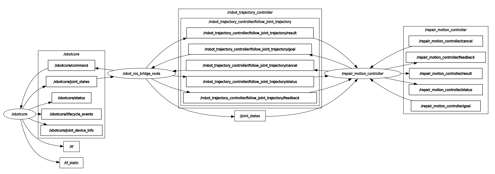

## RePAIR Motion Controller ROS Action Server Pkg

This ROS package provides an action server node for trajectory planning and control of the two-armed `RePAIR` robot using the `xbot2` framework. The action server supports goal execution for the left arm, the right arm, or both arms simultaneously. It leverages the Klampt library for motion planning and communicates planned trajectories to the `xbot_ros_bridge` node via the `FollowJointTrajectory` action interface. 

The `xbot_ros_bridge` node translates the received `FollowJointTrajectory` goals into joint commands and publishes them to the `/xbotcore/command` topic. Additionally, it bridges the robot's state information by converting `/xbotcore/joint_states` to the standardized `/joint_states` topic for compatibility with ROS tools. 

</br></br>



</br></br>

---

### Package contents:
```
repair_motion_planner/ 
├── action/ 
│   └── RepairMoveTo.action
│
├── config/
│   ├── hall/
│   │   └── repair_dummy.yaml
│   ├── joint_config/
│   │   ├── home_joint_config.yaml
│   │   └── joint_map.yaml                  # not used
│   ├── joint_physics/
│   │   ├── idle.yaml                       # not used
│   │   ├── impd4.yaml                      # not used
│   │   └── pos3b.yaml                      # not used
│   └── repair_xbot_config.yaml
│
├── include/repair_motion_controller/ 
│           └── xbot_ros_bridge.hpp 
│
├── launch/ 
│   ├── bringup_motion_controller_with_dummy.launch 
│   └── bringup_motion_controller.launch 
│
├── robot_description/ 
│   ├── realsense_description_l515/**      
│   ├── repair_description/meshes/**      
│   ├── softhand_description/**           
│   ├── klampt_world.xml
│   ├── repair_full.urdf
│   └── repair_full.srdf
│ 
├── scripts/ 
│   ├── bringup_xbot_dummy.sh               # executable 
│   ├── repair_klampt_motion_planner.py 
│   ├── repair_motion_control_server.py     # executable (node)
│   └── run_xbot2_dummy.py                  # executable
│
├── src/
│   └── xbot_ros_bridge.cpp                 # executable (node)
│
├── CMakeLists.txt
├── package.xml
├── README.md 
└── rqt_graph.png
```

</br></br>

---

### Installation

01. Install `Klampt`:
    ```bash

    pip3 install klampt
    ```
02. Install `xbot2`:
    ```bash
    sudo sh -c 'echo "deb http://xbot.cloud/xbot2/ubuntu/$(lsb_release -sc) /" > /etc/apt/sources.list.d/xbot-latest.list'
    wget -q -O - http://xbot.cloud/xbot2/ubuntu/KEY.gpg | sudo apt-key add -
    sudo apt update
    sudo apt install xbot2_desktop_full
    ```

    source `xbot2`
    ```bash
    echo ". /opt/xbot/setup.sh" >> ~/.bashrc
    ```


</br>

02. Install the pkg:
-  Create a catkin workspace if it does not already exist:
    ```bash
    mkdir -p ~/catkin_ws/src

    ```
- clone this repo and build:
    ```bash
    cd ~/catkin_ws/src
    git clone https://github.com/RePAIRProject/repair_motion_controller.git
    cd ~/catkin_ws
    catkin build
    source devel/setup.bash
    ```

</br></br>

---

### launch the motion controller

- **Launch with the dummy**:
    ```bash
    roslaunch repair_motion_controller bringup_motion_controller_with_dummy.launch 
    ```
- **Launch for real robot**:
    ```bash
    roslaunch repair_motion_controller bringup_motion_controller.launch 
    ```


</br></br>

---

### Terminal commands for sending goal poses to test
<details>
  <summary> Click to expand!</summary>

- For Left Arm:
    ```bash
    rostopic pub /repair_motion_controller/goal repair_motion_controller/RepairMoveToActionGoal "goal:
      arm: 0
      target_time: 5.0
      target_pose_left:
        position:
          x: 0.4105
          y: 0.4265
          z: 1.3946
        orientation:
          x: -0.4968
          y: 0.2990
          z: 0.1906
          w: 0.7920
    "
    ```

- For Right Arm:
    ```bash
    rostopic pub /repair_motion_controller/goal repair_motion_controller/RepairMoveToActionGoal  "goal:
      arm: 1 
      target_time: 5.0
      target_pose_right:
        position:
          x: 0.3854
          y: -0.2531
          z: 1.3946
        orientation:
          x: 0.4969
          y: 0.2992
          z: -0.1912
          w: 0.7920
    "
    ```

- For Both Arms:
    ```bash
    rostopic pub /repair_motion_controller/goal repair_motion_controller/RepairMoveToActionGoal  "goal:
      arm: 2 
      target_time: 5.0
      target_pose_left:
        position:
          x: 0.0105
          y: 0.0265
          z: 1.2946
        orientation:
          x: -0.4968
          y: 0.2990
          z: 0.1906
          w: 0.7920
      target_pose_right:
        position:
          x: 0.5854
          y: -0.8531
          z: 1.2946
        orientation:
          x: 0.4969
          y: 0.2992
          z: -0.1912
          w: 0.7920
    "
    ```

  - Home Pose:
    ```bash
    rostopic pub /repair_motion_controller/goal repair_motion_controller/RepairMoveToActionGoal  "goal:
      arm: 2 
      target_time: 5.0
      target_pose_left:
        position:
          x: 0.2281434536725418
          y: 0.2229998203688685
          z: 1.5244485559609986
        orientation:
          x: 0.3745776186543538
          y: -0.22078314586194223
          z: -0.046757647640861
          w: 0.8993109209242547
      target_pose_right:
        position:
          x: 0.21597898714022729
          y: -0.24652714722018665
          z: 1.5566318838742945
        orientation:
          x: -0.37453463410597837
          y: -0.22085599528517516
          z: 0.0462163918152999
          w: 0.899338914052578
    "
    ```
</details>


</br></br>

---

### Klampt Planner Configuaration:

Configuration for `klampt` planner and `vis` can be found here: [repair_klampt_motion_planner.py (line 40)](./scripts/repair_klampt_motion_planner.py#L40)


```bash
rostopic pub /repair_motion_controller/goal repair_motion_controller/RepairMoveToActionGoal "goal:
  arm: 0
  target_time: 5.0
  target_pose_left:
    position:
      x: 0.209084877905509
      y: 0.8942570077661147
      z: 1.5993823229724475
    orientation:
      x: 0.14842500925008567
      y:  -0.19495901809158783
      z: -0.10065531515921401
      w: 0.9642766747277853
"

```


---

```bash
rostopic pub /repair_motion_controller/goal repair_motion_controller/RepairMoveToActionGoal  "goal:
      arm: 0 
      target_time: 5.0
      target_pose_left:
        position: 
          x: 0.1958703240833261
          y: -0.08758726582177793
          z: 1.1830868757440036
        orientation: 
          x: -0.05987144540615223
          y: 0.6858928654870733
          z: 0.04999987613342634
          w: 0.7235097784311916
    "
```


<!-- ======================= TEST GOALS ============================== -->

<!-- 01 -->

```bash
rostopic pub /repair_motion_controller/goal repair_motion_controller/RepairMoveToActionGoal  "goal:
      arm: 0
      target_time: 3.0
      target_pose_left:
        position: 
          x: 0.12023535437848279
          y: 0.0352127
          z: 1.325
        orientation: 
          x: 0.0
          y: -0.7071067
          z: 0.0
          w: -0.7071067
    "
  ```

<!-- 02 -->

```bash
rostopic pub /repair_motion_controller/goal repair_motion_controller/RepairMoveToActionGoal  "goal:
      arm: 0
      target_time: 5.0
      target_pose_left:
        position: 
          x: 0.12023535437848279
          y: 0.0352172
          z: 1.325
        orientation: 
          x: 0.0
          y: -0.79280532
          z: 0.0
          w: -0.6094749
    "
  ```

<!-- 03 -->

```bash
rostopic pub /repair_motion_controller/goal repair_motion_controller/RepairMoveToActionGoal  "goal:
      arm: 0
      target_time: 5.0
      target_pose_left:
        position: 
          x: 0.14023534
          y: 0.035217240
          z: 1.075
        orientation: 
          x: 0.0
          y: -0.79280532
          z: 0.0
          w: -0.609474957
    "
  ```

<!-- 04 -->

```bash
rostopic pub /repair_motion_controller/goal repair_motion_controller/RepairMoveToActionGoal  "goal:
      arm: 0
      target_time: 5.0
      target_pose_left:
        position: 
          x: 0.14023534
          y: 0.035217240
          z: 1.2475
        orientation: 
          x: 0.0
          y: -0.792805
          z: 0.0
          w: -0.609474957
    "
  ```

<!-- 05 -->

```bash
rostopic pub /repair_motion_controller/goal repair_motion_controller/RepairMoveToActionGoal  "goal:
      arm: 0
      target_time: 3.0
      target_pose_left:
        position: 
          x: 0.2
          y: 0.5
          z: 1.35
        orientation: 
          x: 0.0
          y: -0.79281
          z: 0.0
          w: -0.609474957
    "
  ```